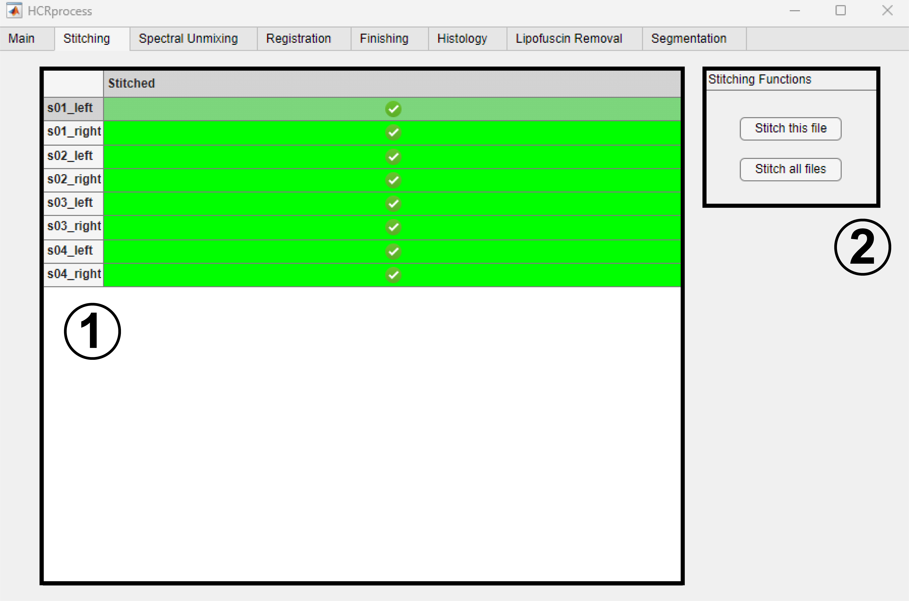
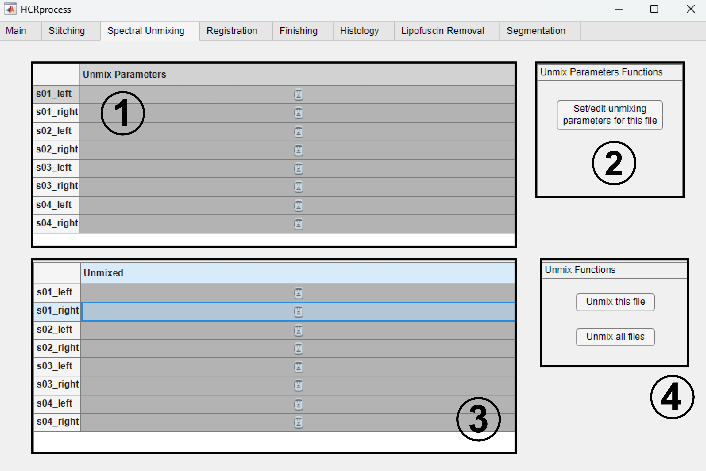
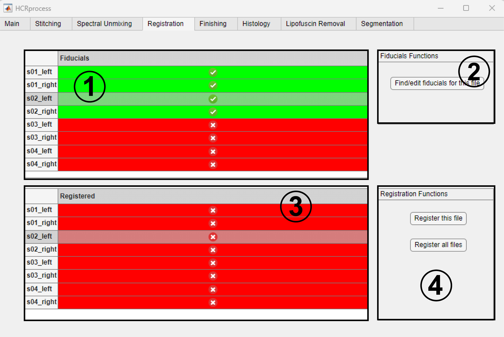
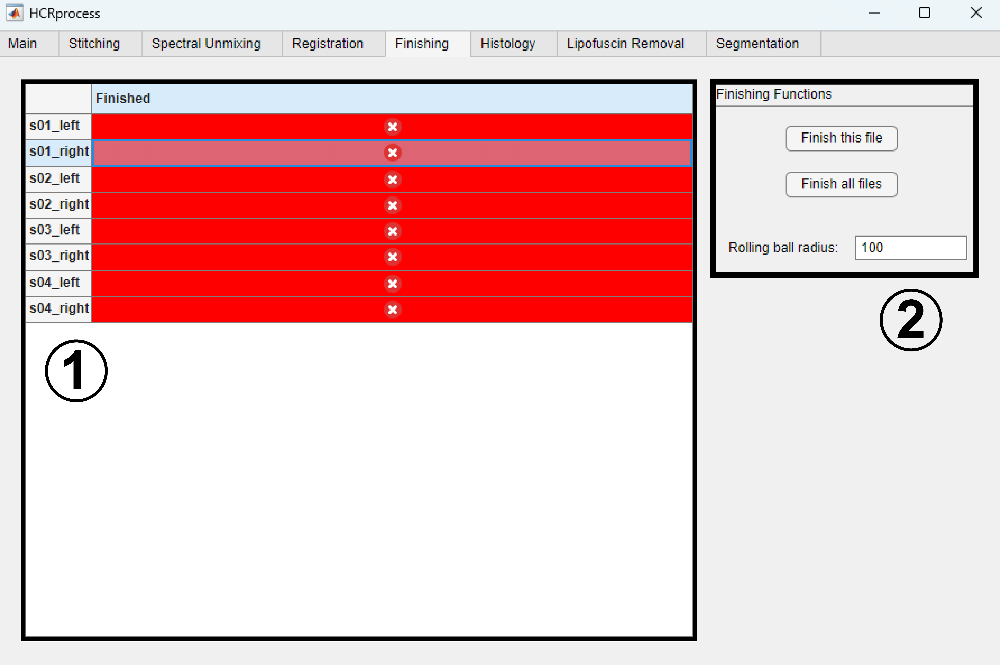

Core
------------------------------

Stitching
~~~~~~~~~~~~~~~~~~~~~~~

This tab is where image files are stitched using ImageJ's Stitching plugin. 

#. Select a file by clicking on it in the ``Stitched`` table. 

#. Press ``Stitch this file`` to stitch only the currently selected file. Press ``Stitch all files`` to stitch all files that haven't yet been stitched.

After files are stitched, z-planes composed of more than 50% blank pixels are deleted. These are often found at the start or end of a multi-z stack and are artifacts of the stitching algorithm. 

.. note::
    Image stitching is a required step before any subsequent processing can be completed. Therefore, the pipeline switch is always turned on by default and cannot be turned off.  

Spectral Unmixing 
~~~~~~~~~~~~~~~~~~~~~~~

This tab is where image files are spectrally unmixed using a custom GUI developed by Michael Economo. Spectral unmixing is composed of two steps: setting the unmixing parameters (which must be done manually), and the actual unmixing of the files (which is done automatically). Unmix parameters must be set before the image is unmixed. 

#. Select a file by clicking on it in the ``Unmix Parameters`` table. 

#. Pressing ``Set/edit unmixing parameters for this file`` will open a GUI where unmixing parameters for the currently selected file can be set. Previously saved unmix parameters are automatically loaded. They can be edited and resaved as many times as desired. 

#. Once you have saved appropriate unmixing parameters, select a file in the ``Unmixed`` table by clicking on it. 

#. Press ``Unmix this file`` to unmix only the currently selected file. Press ``Unmix all files`` to unmix all files that haven't yet been unmixed (only unmixes files for which unmixing parameters exist).

.. note::
    For detailed instructions on how to set unmixing parameters using the popup Unmixing GUI, see :ref:`Spectral Unmixing GUI`. 

Registration
~~~~~~~~~~~~~~~~~~~~~~~

This tab is where image files are registered to image files collected in a designated registration round using a custom GUI developed by Michael Economo and an itk-elastix wrapper developed by Will Cunningham. Registration is composed of two steps: finding fiducials for an initial affine transform (which must be done manually), and an itk-elastix intensity-based B-spline warp (which is done automatically). Fidcuials for the initial affine transform must be set before the image is registered. 

#. Select a file by clicking on it in the ``Fiducials`` table. 

#. Pressing ``Find/edit fiducials for this file`` will open a GUI where fiducials for the currently selected file can be set. Previously saved fiducials are automatically loaded. They can be edited and resaved as many times as desired. 

#. Once you have saved appropriate fiducials, select a file in the ``Registered`` table by clicking on it. 

#. Press ``Register this file`` to register only the currently selected file. Press ``Register all files`` to register all files that haven't yet been registered (only registers files for which fiducials exist).

After files are registered, saturated pixels are converted to black pixels. These are often found at the boundaries of the transformed image and are artifacts of the registration algorithm. 

.. note::
    Registration is the slowest, most computationally demanding, and most memory intensive portion of the HCRprocess pipeline.   

Finishing
~~~~~~~~~~~~~~~~~~~~~~~

This tab is where final pre-processing steps are carried out, and images are split into their consitutent channels for subsequent post-processing. 

#. Select a file by clicking on it in the ``Finished`` table. 

#. Press ``Finish this file`` to finish only the currently selected file. Press ``Finish all files`` to finish all files that haven't yet been finished. ``Rolling ball radius`` corresponds to the radius of the rolling ball for background subtraction.

Finishing preprocessing consists of the following steps: rolling ball background subtraction, constrast adjustment, channel splitting.
