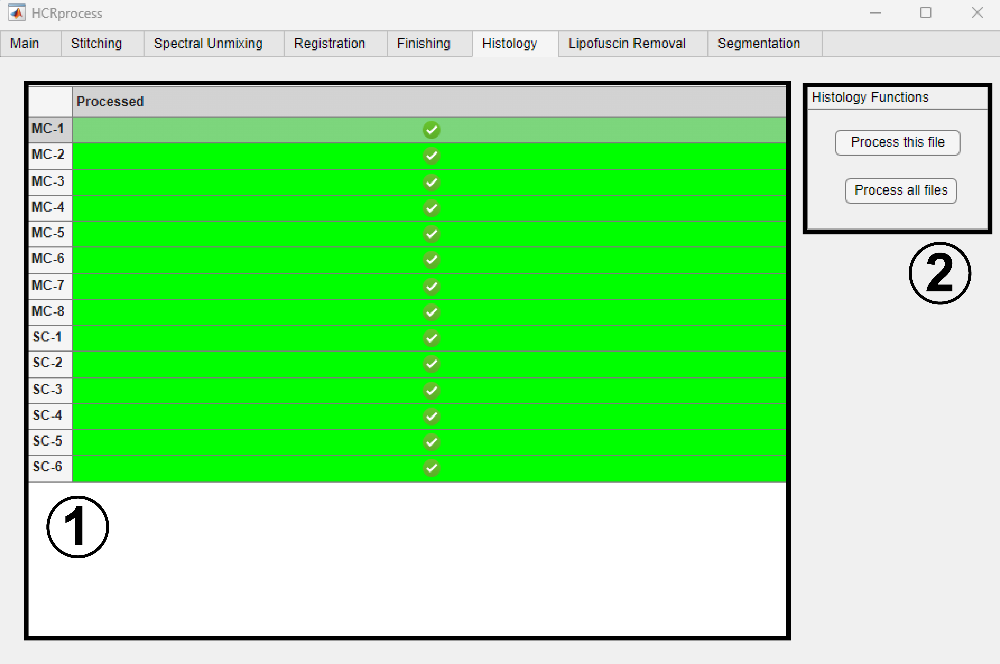

Histology
------------------------------

The ``Histology`` tab can be used to process histology files. These operations can be carried out at any point during processing an experiment and only require the existence of a histology directory in the experiment directory.

#. Select a file by clicking on it in the ``Processed`` table. 

#. Press ``Process this file`` to process only the currently selected file. Press ``Process all files`` to process all files that haven't yet been processed.

Histology file processing currently works automatically with vsi and nd2 files and consists of the following steps (if necessary given the file type): stitching, extraction of the highest resolution file, conversion to a composite multi-channel image, and saving as a tiff. 
