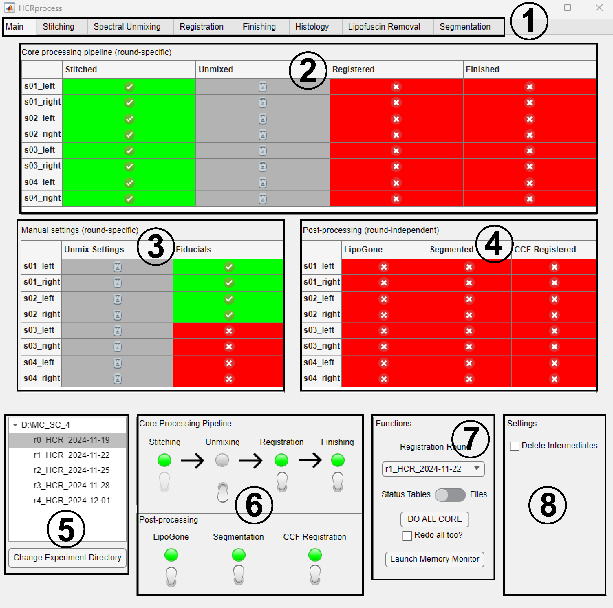

Main
------------------------------

The ``Main`` tab is the central tab of HCRprocess from which all files in a round can be reviewed. Beneath the main tab's file tables are main functions which can be used in any tab of HCRprocess.

#. Click on each tab to navigate around HCRprocess

#. Core processing pipeline table: gives the status of each core processing operation for each file in the currently selected round. ✅ Green checkmarks denote completed operations, ❌ red x's denote incomplete operations, and 🗿 gray Moais denote operations that have been disabled for this round. 

#. Manual settings table: gives the status of each manual settings operation for each file in the currently selected round.

#. Post processing table: gives the status of each post processing operation for this experiment. Post processing operations are not round-specific; they are completed only once per experiment. 

#. Experiment directory: Shows the current experiment directory as well as each round folder contained within the directory. Click on round folders to change the active round folder. Click ``Change Experiment Directory`` to change the experiment directory using a folder selection dialog box. 

#. Processing pipelines: Switches which can enable and disable portions of the core and post-processing pipelines. The ``Core Processing Pipeline`` switches are round-specific. ``Stitching`` is a required operation before all subsequent operations, therefore it is permanently enabled for all rounds.

#. Main functions:

   * Registration Round: Set the registration round using a drop-down menu. This is the round that all other rounds will be registered to. That round's registration operation is automatically disabled, since there's no need to register a round to itself. Upon loading an experiment directory for the first time, HCRprocess will attempt to find the registration round by looking for a registration round token ('r1' by default). If it's unable to find it, this parameter must be set manually before carrying out registration operations. 

   * Status Tables / Files Switch: Switch between displaying status tables and files. Status tables keep track of which operations have been completed, but if intermediate files are deleted these may not match the actual files found in the experiment directory. It is recommended to keep this switch set to ``Status Tables`` unless you are troubleshooting.

   * DO ALL CORE: This button will attempt to perform all possible core operations for the current round folder for every file. If certain operations are impossible due to a lack of input files from previous operations or a lack of manual settings, those operations are skipped and logged in a cache which is reported once all operations have been completed. This cache is displayed in the console and lists every incomplete operation for every file. Check ``Redo all too?`` to do all operations for every file, even if they have already been completed. Not checking this box means operations that have already been completed will be skipped. 

   * Memory Monitor: This button will launch a separate app which displays RAM usage by MATLAB as a percentage of allocated RAM. This app also contains a button for manual garbage collection. It is recommended to only use this app for troubleshooting. 

#. Settings panel: 

   * Delete Intermediates: If checked, input files to every core processing operation will be deleted upon completion of that operation. While not necessary for HCRprocess to function, this will save disk space wherever the experiment directory is stored. Even if this setting is checked, raw files will not be deleted after stitching as a precaution. HCRprocess should always be run on locally stored files that are duplicates of raw files stored on the research drive. If you'd like to delete locally stored raw files after they've been processed to save space, this must be done manually.  
